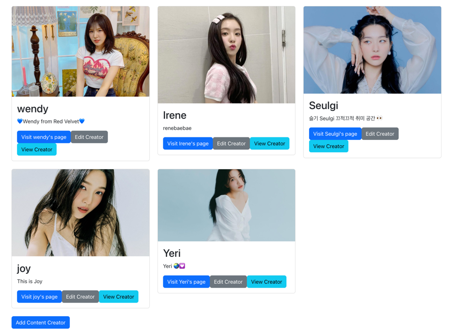

# WEB103 Prework - *👉🏼 Creatorversee*

Submitted by: **👉🏼 Jiqing Sun**

About this web app: **👉🏼 Introducing some creators allowing edit**

Time spent: **👉🏼 3** hours

## Preview

## Required Features

The following **required** functionality is completed:

<!-- 👉🏿👉🏿👉🏿 Make sure to check off completed functionality below -->
- ✅ **A logical component structure in React is used to create the frontend of the app**
- ✅ **At least five content creators are displayed on the homepage of the app**
- ✅ **Each content creator item includes their name, a link to their channel/page, and a short description of their content**
- ✅ **API calls use the async/await design pattern via Axios or fetch()**
- ✅ **Clicking on a content creator item takes the user to their details page, which includes their name, url, and description**
- ✅ **Each content creator has their own unique URL**
- ✅ **The user can edit a content creator to change their name, url, or description**
- ✅ **The user can delete a content creator**
- ✅ **The user can add a new content creator by entering a name, url, or description and then it is displayed on the homepage**

The following **optional** features are implemented:

- ✅ Picocss is used to style HTML elements
- ✅ The content creator items are displayed in a creative format, like cards instead of a list
- ✅ An image of each content creator is shown on their content creator card

## Video Walkthrough

Here's a walkthrough of implemented required features:

GIF created with  👉🏼 LiceCap

## License

Copyright 2023 Jiqing Sun
